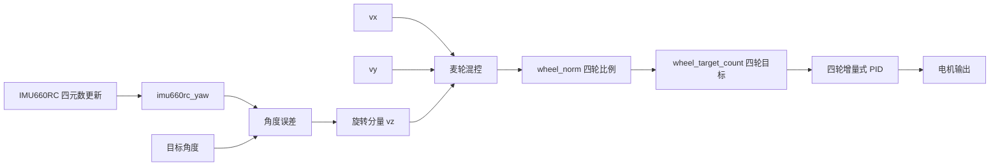

# 姿态闭环框架

这份文档只定义姿态闭环的控制框架，不写具体电机驱动实现，也不把识别、规划和执行混在一起。

## 当前硬件前提

当前姿态闭环硬件链路按以下前提处理：

- 主控：RT1064 V3.0 主板。
- 姿态传感器：逐飞 `IMU660RC`。
- 编码器：4 路逐飞增量式编码器。
- 电机执行：4 个麦轮电机，通过 2 个电机驱动信号接口控制。
- 轮速反馈：编码器接口 1、2、3、4 分别接四个轮子的编码器。

主板说明书中姿态传感器接口点名适配 `IMU660RA`。本项目确认 `IMU660RC` 与 `IMU660RA` 为同接口、同协议，因此控制框架和驱动接入时可以按 `IMU660RA/IMU660RC` 兼容链路处理。

主板侧硬件接口不再视为缺口。后续重点是固定接线、轮序、方向约定和软件节拍。

## 坐标系与轮序约定

当前项目固定使用以下车体坐标系：

- 车头方向：以屏幕 / OpenART 朝向的前方为车头。
- `+Y`：车体前方。
- `+X`：车体右侧。
- `+yaw`：逆时针转向。

四轮命名固定为：

- `LF`：左前轮。
- `LB`：左后轮。
- `RF`：右前轮。
- `RB`：右后轮。

后续接线表、混控公式、编码器方向校验和 PID 参数都必须使用这套轮序，不在代码里临时换名。

## 电机驱动接口映射

当前电机驱动接口按左右分组：

- 电机驱动信号接口 1：
  - 通道 1 -> `LF`
  - 通道 2 -> `LB`
- 电机驱动信号接口 2：
  - 通道 1 -> `RF`
  - 通道 2 -> `RB`

后续四轮 PWM 输出和方向控制都按这个映射处理。

## 编码器接口映射

当前编码器反馈接口与轮序保持一致：

- 编码器接口 1 -> `LF`
- 编码器接口 2 -> `LB`
- 编码器接口 3 -> `RF`
- 编码器接口 4 -> `RB`

后续轮速采样、PID 反馈和故障排查都按这个映射处理。

## 轮速正方向约定

每个轮子的正轮速统一定义为：单独让该轮正转时，它对车体产生的前进 `+Y` 分量为正。

实际调试时不直接信任电机线序或编码器线序。每个轮子都需要低 PWM 点动确认方向，再通过软件符号修正：

- `motor_dir_sign[4]`：修正电机输出方向。
- `encoder_dir_sign[4]`：修正编码器反馈方向。

文档和控制代码只固定控制坐标系的正方向，不把某根线的物理接法当成永远正确的前提。

## 麦轮混控公式

麦轮混控公式按 WPILib 的 MecanumDrive 逆运动学换算到本项目坐标系。

WPILib 约定：

- `+x`：车体前方。
- `+y`：车体左侧。
- `+z`：逆时针旋转。

本项目约定：

- `+Y`：车体前方。
- `+X`：车体右侧。
- `+yaw`：逆时针旋转。

因此变量映射为：

```text
wpilib_x = vy
wpilib_y = -vx
wpilib_z = vz
```

在常见 X 型麦轮滚子布局下，第一版混控公式固定为：

```text
LF = vy - vx + vz
LB = vy + vx + vz
RF = vy + vx - vz
RB = vy - vx - vz
```

如果实际麦轮滚子装成反 X，横移项 `vx` 的符号需要整体反向。公式落代码前仍然要用低 PWM 点动和整车前后/左右/原地旋转测试校验 `motor_dir_sign[4]` 与 `encoder_dir_sign[4]`。

`vx/vy/vz` 是车体运动意图，不是真实速度单位。混控后的四轮输出先作为抽象轮速比例 `wheel_norm[4]` 处理：

```text
vx/vy/vz -> mecanum_mix -> wheel_norm[4]
```

当多个运动分量叠加导致任意轮子的绝对值超过 `1.0` 时，四个轮子的比例必须一起缩放回 `[-1.0, +1.0]`，保持方向和轮间比例不变。

第一版硬件映射采用保守上限：

```text
MAX_WHEEL_TARGET_COUNT = 80      // count/20ms
MAX_PWM_DUTY           = 3000    // 0~10000
```

映射关系：

```text
wheel_target_count = wheel_norm * MAX_WHEEL_TARGET_COUNT
signed_pwm         = limit(pid_output, -MAX_PWM_DUTY, +MAX_PWM_DUTY)
```

后续板测确认单轮方向、编码器方向和原地回正稳定后，再逐步提高上限。

## 目标

- 麦轮车在平移时保持目标朝向。
- 原地转向时稳定回到目标角度。
- 轮速闭环和姿态闭环分层处理，互不抢职责。

## 控制分层

### 1. 感知层

- 5ms 周期更新 IMU660RC 数据。
- 使用驱动内置四元数解算结果 `imu660rc_yaw` 作为当前航向角。
- 陀螺仪原始值只作为备用调试数据，不作为第一版姿态角来源。

### 2. 姿态层

- 输入：`target_yaw` 和当前 `yaw`。
- 计算角度误差 `err_yaw`。
- 将 `err_yaw` 转成旋转分量 `vz`。
- `vx`、`vy` 只负责平移，`vz` 只负责纠偏。

### 3. 运动混控层

- 输入：`vx`、`vy`、`vz`。
- 输出四轮目标转速：
  - `LF`
  - `LB`
  - `RF`
  - `RB`

### 4. 速度闭环层

- 20ms 周期执行。
- 四个轮子各自做增量式 PID。
- 输出最终 PWM / 方向控制量。

## 时序

```text
5ms  -> 更新 IMU660RC 四元数解算结果 + 读取 imu660rc_yaw
20ms -> 姿态控制 + 麦轮混控 + 四轮 PID
```

控制节拍由 PIT 中断统一驱动：

- `PIT_CH0`：5ms，只做 IMU 数据更新、四元数解算、更新 `imu660rc_yaw`。
- `PIT_CH1`：20ms，做姿态环、麦轮混控、编码器轮速读取、四轮 PID、PWM 输出。
- `while(1)`：不做闭环控制，只做 UI、串口命令、状态显示和调参输入。
- `GPIO3_Combined_0_15_IRQHandler` 中的 IMU 中断只清除 `IMU660RC_INT2_PIN` 标志，不再调用姿态更新函数，避免 PIT 5ms 路径和 GPIO 中断路径重复更新四元数。

当前姿态角来源固定使用 IMU660RC 驱动内置四元数解算后的欧拉角：

- 只在 `PIT_CH0` 的 5ms 周期里调用 `imu660rc_get_quarternion()`。
- 使用全局变量 `imu660rc_yaw` 作为当前航向角。
- `imu660rc_yaw` 单位为 `degree`，范围按驱动输出为 `0~360`。
- 姿态误差必须做最短角度差，归一到 `-180~180`，不能直接使用 `target_yaw - imu660rc_yaw`。

陀螺仪原始值只作为备用调试数据：

- `imu660rc_gyro_transition(imu660rc_gyro_z)` 的单位为 `degree/s`。
- 若后续需要自积分，才使用 `yaw += gyro_z_dps * 0.005f`。

建议顺序固定为：

1. 先更新角度。
2. 再算姿态误差。
3. 再算轮速目标。
4. 最后下发到四轮 PID。

## 运动指令分层

上层任务可以使用离散运动命令，例如：

- 前进
- 后退
- 左移
- 右移
- 左前
- 左后
- 右前
- 右后
- 原地左转
- 原地右转

这些离散命令在进入底层控制前统一转换为车体运动指令：

```text
vx: 车体右向平移分量，+vx 表示向右
vy: 车体前向平移分量，+vy 表示前进
vz: 车体逆时针旋转分量，+vz 表示逆时针旋转
```

第一版 `MOTION_TURN_LEFT/RIGHT` 按离散转向处理，不直接绕过姿态环输出连续 `vz`。每次调用转向命令时，用 `turn_speed` 的符号和幅值对 `target_yaw` 做一次步进：

```text
target_yaw += clamp(manual_vz, -1, +1) * TURN_STEP_DEG
```

因此上层若要“转一次”，只调用一次转向命令；若周期性重复调用，就表示持续追加目标角步进。

`MOTION_STOP` 和 `stop_motion()` 表示真正停止输出：清 `vx/vy/vz`，重置四轮 PID，并把 `target_yaw` 更新为当前 `yaw`，避免下一次 20ms 姿态环因为旧目标角误差再次输出旋转。若需要“原地保持某个目标角”，不要调用 `stop_motion()`，而是保持 `vx=0`、`vy=0` 并设置目标角。

`test_wheel()` 用于 #9 单轮低 PWM 点动。进入点动后，20ms 闭环不再覆盖该 PWM；调用任意正常运动命令、设置目标角或 `stop_motion()` 会退出点动模式。

`LF/LB/RF/RB` 不是车体运动指令，而是 `vx/vy/vz` 经过麦轮混控后的四轮目标速度。

## 姿态环算法

姿态环固定使用 PD，不使用积分项。

```text
err_yaw = shortest_angle_error(target_yaw, imu660rc_yaw)
vz = kp_yaw * err_yaw + kd_yaw * (err_yaw - last_err_yaw) / dt
```

- `err_yaw` 必须归一到 `-180~180`。
- `dt` 第一版取 `0.02s`，对应 20ms 姿态环周期。
- `vz` 输出后必须限幅到允许范围。
- 不使用 I 项，避免静态小误差积累后造成原地抖动。

## 四轮速度环定义

四轮速度环第一版直接使用编码器计数，不换算成真实线速度。

输入：

```text
wheel_target_count[4]    // 四轮目标速度，单位 count/20ms
wheel_feedback_count[4]  // 四轮编码器反馈，单位 count/20ms
```

输出：

```text
motor_pwm[4]             // PWM duty，范围 0~10000
motor_dir[4]             // 正反转方向
```

速度环职责：

```text
wheel_error = wheel_target_count - wheel_feedback_count
PID 输出 signed_pwm
signed_pwm > 0 -> 正转
signed_pwm < 0 -> 反转
abs(signed_pwm) -> PWM duty
```

- 编码器反馈通过 `encoder_get_count()` 获取，并在每个 20ms 速度环周期后清零。
- PWM 输出按逐飞库 `PWM_DUTY_MAX = 10000` 处理。
- 第一版四轮速度环使用增量式 PID；姿态环使用 PD。

## 数据流



## 推荐文件拆分

第一版拆成 5 对 `.c/.h` 模块文件，共 10 个文件。文件与公共 C 接口均按职责短名命名，不统一添加底盘领域前缀；全局函数以 `control_init()`、`io_init()` 等“职责词 + 动作”形式维持可辨识性。

```text
drive_config.h
drive_config.c
motion_math.h
motion_math.c
wheel_pid.h
wheel_pid.c
base_io.h
base_io.c
drive_control.h
drive_control.c
```

各文件职责如下：

- `drive_config.h` / `drive_config.c`：放固定配置和初始参数，包括 `LF/LB/RF/RB` 枚举、`motor_dir_sign[4]`、`encoder_dir_sign[4]`、`MAX_WHEEL_TARGET_COUNT`、`MAX_PWM_DUTY`、四轮速度环 PID 初值和 yaw PD 初值。方向符号在 `.c` 中只有一份定义，方便板测时统一修改。
- `motion_math.c/h`：只放纯数学逻辑，包括最短角度误差、姿态 PD、`vx/vy/vz` 到四轮混控、`wheel_norm[-1,+1]` 归一化、`wheel_norm` 到 `wheel_target_count` 的映射。这层不直接调用逐飞硬件 API。
- `wheel_pid.c/h`：放四轮增量式 PID。输入目标 `count/20ms` 和反馈 `count/20ms`，输出 signed PWM。
- `base_io.c/h`：封装底盘硬件访问，包括读取 `imu660rc_yaw`、读取并清除编码器计数、设置单个轮子的方向和 PWM。逐飞库 API 只集中在这一层调用。
- `drive_control.c/h`：闭环调度层，保存目标 yaw、运动命令和控制状态，负责把 5ms IMU 更新、20ms 姿态环、混控、四轮速度环和硬件输出串起来。

`isr.c` 只调用底盘模块提供的周期函数，不直接写 PID、混控、编码器读取和 PWM 输出细节：

```c
update_imu_5ms();
update_control_20ms();
```

`main.c` 只负责初始化、UI/串口调参和设置运动命令，不承担闭环控制计算。后续接 Push Box 路径执行时，上层只调用运动接口，不直接接触电机、编码器和 PID。

当前代码已经按上述拆分落地到 `project/user/inc` 和 `project/user/src`，并加入 Keil MDK 工程 `project/mdk/rt1064.uvprojx`。实际接入点为：

- `main.c`：调用 `control_init()`，不承担闭环计算。
- `isr.c` / `PIT_CH0`：调用 `update_imu_5ms()`。
- `isr.c` / `PIT_CH1`：调用 `update_control_20ms()`。
- `isr.c` / `GPIO3_Combined_0_15_IRQHandler`：只清 `IMU660RC_INT2_PIN`，不调用 `imu660rc_callback()`。

当前第一版硬件引脚按第 21 届智能视觉组参考表处理：

- `LF`：DRV8701E 驱动 1 通道 1，`DIR=C10`，`PWM=C11`。
- `LB`：DRV8701E 驱动 1 通道 2，`DIR=D2`，`PWM=D3`。
- `RF`：DRV8701E 驱动 2 通道 1，`DIR=C9`，`PWM=C8`。
- `RB`：DRV8701E 驱动 2 通道 2，`DIR=C7`，`PWM=C6`。
- 编码器 1：`C0/C1` -> `LF`。
- 编码器 2：`C2/C24` -> `LB`。
- 编码器 3：`C3/C4` -> `RF`。
- 编码器 4：`C5/C25` -> `RB`。

当前构建验证命令：

```text
D:\Keil_v5\UV4\UV4.exe -b D:\rt1064\RT1064_Library\SeekFree_RT1064_Opensource_Library\project\mdk\rt1064.uvprojx -o D:\rt1064\RT1064_Library\SeekFree_RT1064_Opensource_Library\project\mdk\build_drive_control.log
```

最近一次结果：`0 Error(s), 0 Warning(s)`。

## PRD 与 Issues

当前姿态闭环实现的父 PRD 已发布到 GitHub Issues：

- PRD：[#6 PRD: RT1064 麦轮姿态闭环控制框架](https://github.com/Yezi23-boop/rt1064/issues/6)
- 标签：`ready-for-agent`

后续按以下垂直切片实现。每个切片都应该能独立验证，不按“只写数学层、只写硬件层”这种横向方式拆。

1. [#7 底盘控制数学链路](https://github.com/Yezi23-boop/rt1064/issues/7)
   - 类型：AFK
   - 阻塞：无
   - 内容：实现离散运动指令、`vx/vy/vz`、最短角度误差、姿态 PD、麦轮混控、归一化、`wheel_target_count` 映射等纯逻辑链路。

2. [#8 底盘模块与定时调度骨架](https://github.com/Yezi23-boop/rt1064/issues/8)
   - 类型：AFK
   - 阻塞：底盘控制数学链路
   - 内容：建立独立底盘控制模块，接入 5ms IMU/yaw 更新边界和 20ms 控制边界，主循环只保留调参和状态入口。

3. [#9 电机与编码器硬件映射 bring-up](https://github.com/Yezi23-boop/rt1064/issues/9)
   - 类型：HITL
   - 阻塞：底盘模块与定时调度骨架
   - 内容：按 `LF/LB/RF/RB` 绑定电机和编码器，加入 `motor_dir_sign[4]`、`encoder_dir_sign[4]`，提供低 PWM 单轮点动和编码器计数验证路径。

4. [#10 四轮速度闭环最小闭环](https://github.com/Yezi23-boop/rt1064/issues/10)
   - 类型：AFK
   - 阻塞：电机与编码器硬件映射 bring-up
   - 内容：把 `wheel_target_count`、编码器 `count/20ms`、四轮增量式 PID、signed PWM 输出串起来，先用保守目标和 PWM 限幅。

5. [#11 原地姿态回正闭环](https://github.com/Yezi23-boop/rt1064/issues/11)
   - 类型：HITL
   - 阻塞：四轮速度闭环最小闭环
   - 内容：`vx = 0`、`vy = 0`，只由姿态 PD 生成 `vz`，验证手转车体后能回到目标 yaw，重点确认 yaw 方向和旋转项符号。

6. [#12 平移姿态保持验证](https://github.com/Yezi23-boop/rt1064/issues/12)
   - 类型：HITL
   - 阻塞：原地姿态回正闭环
   - 内容：验证前进、横移、斜向运动时姿态环叠加到麦轮混控后能压住车头角度偏移。

7. [#13 控制文档与验收步骤同步](https://github.com/Yezi23-boop/rt1064/issues/13)
   - 类型：AFK
   - 阻塞：电机与编码器硬件映射 bring-up、四轮速度闭环最小闭环、原地姿态回正闭环、平移姿态保持验证
- 内容：把实际实现边界、接口、测试顺序、调参入口和硬件校正步骤同步回项目文档，保证后续 Push Box 路径执行能接这个运动接口。

## 推荐接口

后续实现时，建议把代码接口切成下面几层：

- `imu_update_5ms()`
- `attitude_hold_update_20ms()`
- `mecanum_mix(vx, vy, vz, wheel_norm[4])`
- `wheel_targets_from_norm(wheel_norm[4], wheel_target_count[4])`
- `wheel_pid_update(wheel_target_count[4])`
- `motion_set_target(vx, vy, yaw_target)`

## 单独验证顺序

### 1. 原地回正

- 设 `vx = 0`、`vy = 0`。
- 只保留 `vz`。
- 目标角度设为 `0`。
- 手动转动车身，看是否能自动回正。

### 2. 直线保持

- 设定前进速度。
- 目标角度保持不变。
- 检查车体是否边走边偏航。

### 3. 转向保持

- 设定固定角度目标。
- 观察车体转到目标角度后是否稳定停住。

### 4. 平移加回正

- 一边平移，一边保持目标角度。
- 检查姿态环是否持续压住角度漂移。

## 当前边界

这份框架只管控制链路本身，不包含：

- OpenART 识别
- 地图解析
- BFS / 路径规划
- 箱子分类映射
- 炸墙策略
- 实际任务调度

这些内容应该放在上层任务框架里，等姿态闭环先跑稳后再接。
