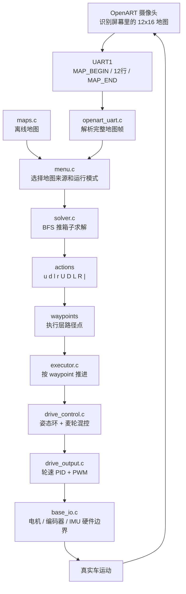
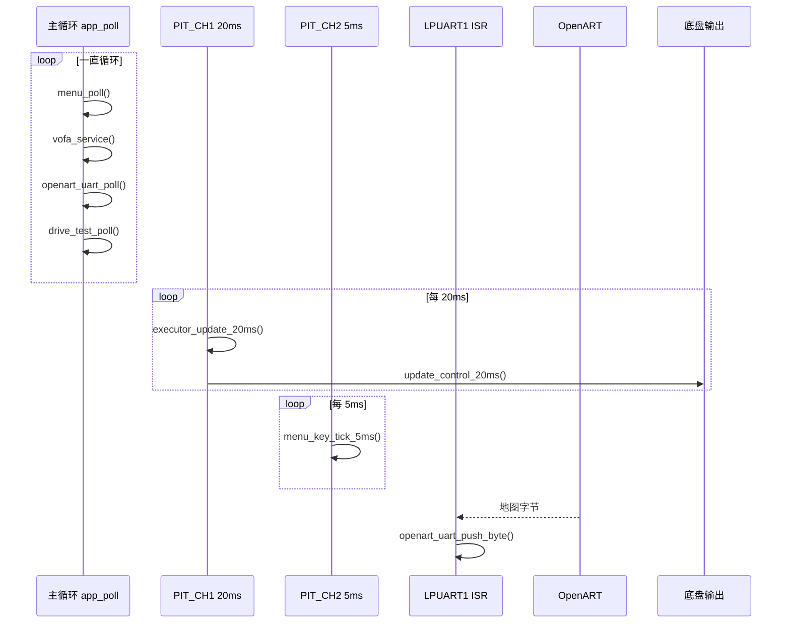

# 指导阅读代码文档

这份文档是给第一次看本工程代码的人准备的。它不要求你一开始就懂 RT1064、PIT 中断、麦轮、BFS 或 OpenART。你只需要先抓住一件事：

> 这套代码的核心，是把“屏幕里的虚拟推箱子地图”变成“真实小车在场地里的格点运动”。

读代码时不要从某一个大文件硬啃。先按下面几条链路看，整体会清楚很多。

## 先看整体：这辆车在做什么

真实比赛逻辑大概是这样：

1. OpenART 看屏幕，识别出 12 行 16 列的虚拟地图。
2. OpenART 通过 UART1 把地图发给 RT1064。
3. RT1064 用推箱子求解器算出动作序列。
4. 动作序列被压缩成 `waypoints`，也就是车要走到的格点。
5. `executor` 按 waypoint 推进。
6. 底盘控制链把 waypoint 变成麦轮速度、轮速 PID 和 PWM。
7. 真实车移动后，屏幕里的虚拟状态变化，OpenART 再识别，MCU 再决策。

整体数据流可以先记成这张图：



这里最容易混淆的是：箱子不是实体物理箱子。箱子、目标点、推箱子规则都发生在屏幕里的虚拟地图中。真实车要做的是尽量准确地走到这些虚拟格点对应的真实位置，让虚拟游戏状态按预期更新。

## 启动链路

先从 `project/user/src/main.c` 看起。它只做启动顺序和主循环。

启动顺序是：

```text
clock_init()
debug_init()
wireless_uart_init()
openart_uart_init()
control_init()
executor_init()
app_init()
while(1) app_poll()
```

每一步的意义：

- `clock_init()`：先把系统时钟拉起来，后面串口、PWM、PIT 都依赖它。
- `debug_init()` 和 `wireless_uart_init()`：准备调试串口和无线串口。当前 `printf` 走无线串口。
- `openart_uart_init()`：清 OpenART 接收状态。注意它清的是协议状态，不负责主循环里的解析。
- `control_init()`：初始化底盘、IMU、编码器、PWM、20ms PIT 控制周期。
- `executor_init()`：初始化路径执行器内部 PID。
- `app_init()`：初始化时间基准、掉电设置、屏幕、VOFA、调车测试、菜单。
- `app_poll()`：主循环短轮询，不做硬实时控制。

应用层初始化在 `project/user/src/app.c`：

```text
timebase_init()
settings_init()
screen_init()
vofa_init()
drive_test_init()
menu_init()
```

这里的重点是：`timebase_init()` 必须早，因为菜单回放、按键节拍、VOFA 超时、ART 等待超时都要用 `time_ms()`。

## 两条时间线

这个工程同时有“主循环时间线”和“中断时间线”。小白读代码时一定要分开看。



### 主循环负责什么

主循环入口是 `app_poll()`：

```text
menu_poll()
vofa_service()
openart_uart_poll()
drive_test_poll()
```

它们分别负责：

- `menu_poll()`：处理按键事件、页面跳转、Run 页求解、Execute 页状态显示、ART 重解算状态机。
- `vofa_service()`：低频输出调试曲线，也可以解析无线摇杆。
- `openart_uart_poll()`：从 UART 环形缓冲取字节，拼成完整 OpenART 地图帧。
- `drive_test_poll()`：运行代码开关式调车测试。

主循环不能长时间卡住。因为一旦卡住，屏幕刷新、OpenART 解析、VOFA 超时和菜单响应都会变慢。

### 中断负责什么

中断入口在 `project/user/src/isr.c`。

`PIT_CH1` 每 20ms 运行：

```text
executor_update_20ms()
update_control_20ms()
```

顺序很重要：先让 executor 根据当前 waypoint 决定本周期的运动命令，再让底盘控制链把命令变成四轮输出。

`PIT_CH2` 每 5ms 运行：

```text
menu_key_tick_5ms()
```

按键扫描放在 5ms 中断里，主循环只消费按键事件。这样屏幕刷新慢一点，也不会影响按键手感。

`LPUART1_IRQHandler()` 只做一件事：把 OpenART 发来的字节塞进 `openart_uart.c` 的环形缓冲。真正解析地图不在 ISR 里做。

`LPUART8_IRQHandler()` 走无线串口，用于 printf、VOFA、无线输入等。

## 推箱子决策链

推箱子相关的公共类型在 `project/user/inc/map_types.h`。

地图固定是：

```text
MAP_ROWS = 12
MAP_COLS = 16
```

地图字符含义：

```text
#  墙
.  空地
B  箱子
T  目标点
C  小车
X  炸弹或障碍，求解时按不可通行处理
```

地图有两个来源：

- 离线地图：`project/user/src/maps.c`
- OpenART 实时地图：`project/user/src/openart_uart.c`

Run 页由 `project/user/src/menu.c` 组织。选择地图来源和模式后，最终会调用：

```text
solve_map(source, &last_result)
```

求解器在 `project/user/src/solver.c`。它会输出两个东西：

1. `actions`
2. `waypoints`

### actions 是什么

`actions` 是原始动作序列，字符含义如下：

```text
u d l r  小车普通移动
U D L R  推箱动作
|        单箱任务边界
```

其中 `|` 很重要。它不是车要走的一步，而是“一个箱子的子任务完成了”。屏幕回放会跳过它，但 solver 和屏幕都靠它保留多箱任务边界。

### waypoints 是什么

`waypoints` 是给执行器用的格点路径。连续同方向、同类型的动作会合并成一个 waypoint，减少执行点数。

但是 waypoint 不能跨过 `|` 合并。否则两个箱子任务会被屏幕和执行器看成一段连续路径，后续动态箱子显示和执行语义都会乱。

## 执行控制链

执行器在 `project/user/src/executor.c`。

它的输入是：

```text
last_result.waypoints
waypoint_count
start_row / start_col
single_step
art_sync
```

启动入口是：

```text
executor_start(...)
```

20ms 推进入口是：

```text
executor_update_20ms()
```

执行器每 20ms 大概做这些事：

1. 看当前 `current_step` 指向哪个 waypoint。
2. 把目标格点换算成相对起点的物理位移。
3. 用本地 `drive_pose_get()` 得到当前估计位置。
4. 用 X/Y 位置 PID 算出世界坐标速度。
5. 按当前 yaw 把世界坐标速度转成车体系 `vx/vy`。
6. 调用 `set_motion(vx, vy)` 交给底盘控制链。
7. 到点后进入段间停稳。
8. 如果是 ART 同步模式，则停车并等待主循环重新识别和重解算。

这里要注意：executor 不直接写 PWM。它只决定“本周期应该往哪个方向动”。真正的电机输出在底盘控制链里。

## 底盘闭环链

底盘链路从 `project/user/src/drive_control.c` 看。

20ms 中断里调用：

```text
update_control_20ms()
```

它的内部流程是：

```text
read_encoder_counts()
drive_imu_sync_status()
update_startup_guard_20ms()
drive_pose_update_20ms()
drive_imu_update_attitude_20ms()
mecanum_mix()
wheel_targets_from_norm()
drive_output_update_and_output()
```

每一层职责如下：

- `base_io.c`：硬件边界，读编码器、写 PWM、处理电机方向和编码器方向。
- `drive_imu.c`：把 IMU yaw 转成控制坐标系，维护姿态 PD。
- `drive_pose.c`：用四轮编码器增量和 yaw 积分出本地位姿。
- `motion_math.c`：纯数学，最短角误差、麦轮混控、轮速归一化。
- `wheel_pid.c`：单轮增量式 PID。
- `drive_output.c`：四轮 PID 输出、起步 PWM 窗口、停车清状态。

可以把底盘闭环理解成：

```text
executor 给 vx/vy
姿态环给 vzt
vx/vy/vz/vzt -> 麦轮混控 -> 四轮目标 count/20ms
四轮目标和编码器反馈 -> 轮速 PID -> signed PWM
signed PWM -> base_io -> 电机
```

### 上电为什么先不动

`drive_control.c` 里有启动保护。IMU 上电前几秒 yaw 可能不稳，所以控制链先保持 PWM 为 0，并持续锁当前 yaw。稳定后才锁定 yaw 零点，允许电机输出。

所以刚上电不动不一定是坏了，可能还在启动安全窗口里。

## ART 重解算链

ART 重解算逻辑在：

```text
project/user/src/art_replan.c
```

它解决的问题是：OpenART 传下来的地图有延迟，车跑到 waypoint 后，不能继续相信旧地图。应该停车，等新完整帧稳定后，以最新地图重新求解。

### 初始 ART 发车

当地图来源是 ART，并且在 Run/Step 模式下启动时：

1. 菜单调用 `art_replan_begin_initial()`。
2. ART 模块丢弃 UART 中尚未解析的旧字节。
3. 等待新的完整稳定地图帧。
4. 对稳定帧调用 `solve_map()`。
5. 求解成功后不会立刻发车。
6. 屏幕显示 `Ready K3`。
7. 用户按 K3 后，才调用 `executor_start()`。

这个 K3 确认是安全门，避免 OpenART 刚识别到一张意外地图，小车就自己动。

### 段间 ART 重解算

执行过程中，如果 executor 到了 waypoint，并且开启 ART 同步：

1. executor 在 20ms 中断里停车。
2. executor 只暴露 `segment_waiting_art` 状态，不在中断里求解。
3. 主循环里的 `art_replan_tick()` 发现需要重解算。
4. 丢弃旧帧，只等新完整稳定帧。
5. 用最新 ART 地图求解。
6. 段间求解成功后直接继续 executor。

初始求解和段间求解的区别是：

```text
初始 ART 求解成功：必须 K3 确认发车
段间 ART 求解成功：自动继续执行
```

## 屏幕和菜单怎么读

菜单逻辑在 `project/user/src/menu.c`，屏幕绘制在 `project/user/src/screen.c`。

可以这样分工理解：

- `menu.c`：管状态、按键、页面跳转、求解、执行、ART 重解算。
- `screen.c`：只负责把传进来的 view 数据画到 IPS200，不直接改业务状态。

常见页面：

- Home：地图编号、模式、保存状态、编码器、yaw、pose、OpenART 帧数。
- Run：选择离线或 ART 地图，发起 Solve/Run/Step。
- Playback：看 solver 输出的动作和动态箱子变化。
- Execute：看 executor 当前状态、当前 waypoint、MCU 本地 pose 和 ART 识别车格。
- ART Map：看 OpenART 最近完整帧。
- Debug：看本地 pose 映射到地图的位置。

如果要看“为什么屏幕显示不对”，先分清是：

```text
menu.c 传错状态
screen.c 画错状态
solver/actions/waypoints 本身含义变了
OpenART 最新帧不对
```

## 推荐阅读顺序

### 路线 1：只想知道程序怎么跑起来

按这个顺序看：

1. `project/user/src/main.c`
2. `project/user/src/app.c`
3. `project/user/src/isr.c`
4. `project/user/src/menu.c`
5. `project/user/src/drive_control.c`

重点看启动顺序、主循环和中断节拍。

### 路线 2：想看推箱子怎么求解

按这个顺序看：

1. `project/user/inc/map_types.h`
2. `project/user/src/maps.c`
3. `project/user/src/solver.c`
4. `project/user/src/screen.c` 里的回放相关逻辑
5. `project/user/src/executor.c`

重点看 `actions`、`waypoints` 和 `|` 分隔符。

### 路线 3：想看 ART 怎么接入

按这个顺序看：

1. `project/user/src/openart_uart.c`
2. `project/user/src/menu.c`
3. `project/user/src/art_replan.c`
4. `project/user/src/screen.c` 的 ART Map 和 Execute 页
5. `project/user/src/executor.c` 的 ART pending 状态

重点看“丢弃旧帧、等待新稳定帧、重新求解”。

### 路线 4：想看车怎么动

按这个顺序看：

1. `project/user/src/executor.c`
2. `project/user/src/drive_control.c`
3. `project/user/src/drive_pose.c`
4. `project/user/src/motion_math.c`
5. `project/user/src/drive_output.c`
6. `project/user/src/base_io.c`

重点看 waypoint 如何变成 `vx/vy`，再变成四轮 PWM。

### 路线 5：想调试硬件方向和横移

按这个顺序看：

1. `project/user/inc/drive_config.h`
2. `project/user/src/base_io.c`
3. `project/user/src/motion_math.c`
4. `project/user/src/drive_output.c`
5. `project/user/src/drive_test.c`

重点看轮序、`motor_dir_sign[]`、`encoder_dir_sign[]`、麦轮混控公式和轮速反馈方向。

## 调试时先看哪里

### 横移困难

优先看：

- `project/user/src/motion_math.c`：麦轮混控公式和 `vx` 方向。
- `project/user/src/base_io.c`：四轮 PWM 映射和电机方向。
- `project/user/src/drive_output.c`：轮速 PID 输出是否被限幅或起步窗口压住。
- Home 页编码器显示：横移时四轮反馈方向是否符合预期。

不要一上来就怀疑 solver。横移困难大概率在底盘混控、轮序、方向、PID 或机械摩擦。

### 到点不准

优先看：

- `project/user/src/executor.c`：到点阈值、稳定计数、段间停稳。
- `project/user/src/drive_pose.c`：编码器如何积分成本地 pose。
- `project/user/inc/drive_config.h`：`GRID_SIZE_CM`、到点阈值、停稳时间。
- Execute 页：比较 `M` 本地推算格、`W` 当前 waypoint、`A` ART 识别格。

到点不准要先分清是“本地 pose 漂了”还是“ART 识别延迟/错误”。

### ART 地图延迟或重解算异常

优先看：

- `project/user/src/openart_uart.c`：是否收到完整帧，`frame_count` 是否增长。
- `project/user/src/art_replan.c`：是否在等新帧，稳定帧计数是否满足。
- ART Map 页：屏幕看到的最近完整帧是否和真实屏幕一致。
- Execute 页：是否显示 `Ready K3`、`Bad ART`、`ART Timeout` 或 `Plan Fail`。

注意：ART 重解算不是一直相信旧帧，而是到 waypoint 后丢弃旧缓冲，等待新稳定帧。

### 屏幕显示不对

优先看：

- `project/user/src/menu.c`：传给屏幕的 view 数据是否正确。
- `project/user/src/screen.c`：是否按正确 step 回放 actions。
- `project/user/src/solver.c`：`actions` 和 `waypoints` 是否符合预期。
- `project/user/src/map_utils.c`：地图快照、统计、找 `C` 是否正确。

如果是 Execute 页底图不刷新，先确认这是设计：执行页显示的是求解时地图快照，避免车还在跑时 ART 实时帧把底图改掉。

### 发车不动

优先看：

- 是否还在上电 yaw 稳定窗口。
- ART 初始模式是否停在 `Ready K3`，需要再按 K3。
- executor 状态是否为 `PAUSED`、`ERROR` 或 `DONE`。
- `drive_test_manual_pwm_active()` 是否占用输出。
- `base_io.c` 的 `motor_output_enabled` 是否仍为 0。

### 求解失败

优先看：

- 地图中是否恰好有一个 `C`。
- `B` 箱子数量是否等于 `T` 目标数量。
- 箱子数量是否超过 `MAX_BOXES`。
- OpenART 识别出的 `X` 是否挡住了路径。
- `solver.c` 中 `message` 给出的失败原因。

## 几个关键概念

### `actions`

给人和屏幕回放看的动作序列。它保留了推箱语义和任务边界。

### `waypoints`

给执行器看的路径点。它把连续同方向动作合并，减少底盘需要停靠的点。

### `drive_pose`

MCU 用编码器和 yaw 推算出来的本地位姿。它不等于 OpenART 识别位置，但可以和 ART 位置互相诊断。

### `run_state`

Run/Execute 页显示用的短文本，不是唯一安全状态。真正决定车是否动的是 executor 状态、底盘输出和 ART 发车确认。

### `last_solve_source`

最近一次求解时用的地图快照。执行页用它当底图，避免实时 ART 帧延迟或抖动直接影响正在执行的显示。

## 最后怎么读最省力

第一次读，不要试图一口气看完所有文件。建议先带着下面三个问题看：

1. 地图从哪里来？
2. 地图怎么变成 waypoint？
3. waypoint 怎么变成电机 PWM？

能回答这三个问题，就已经理解了当前工程的主干。后面再去看屏幕、Flash 保存、VOFA、调车测试、ART 重解算，就不会迷路。
